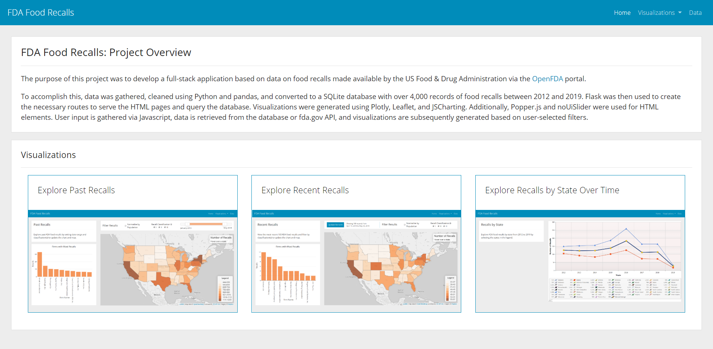
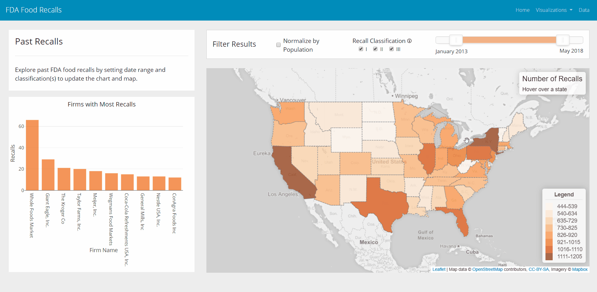
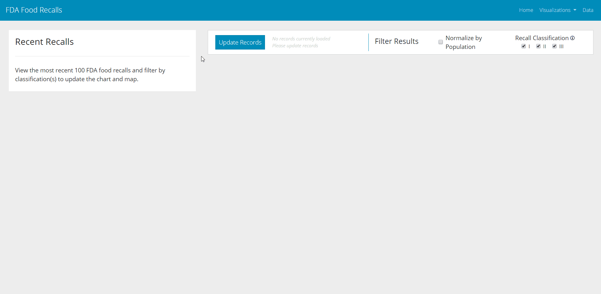
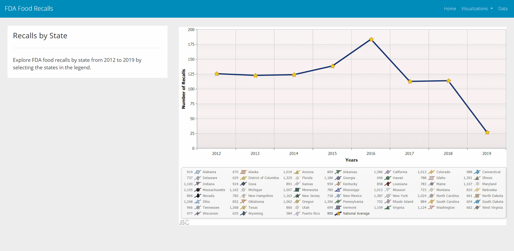
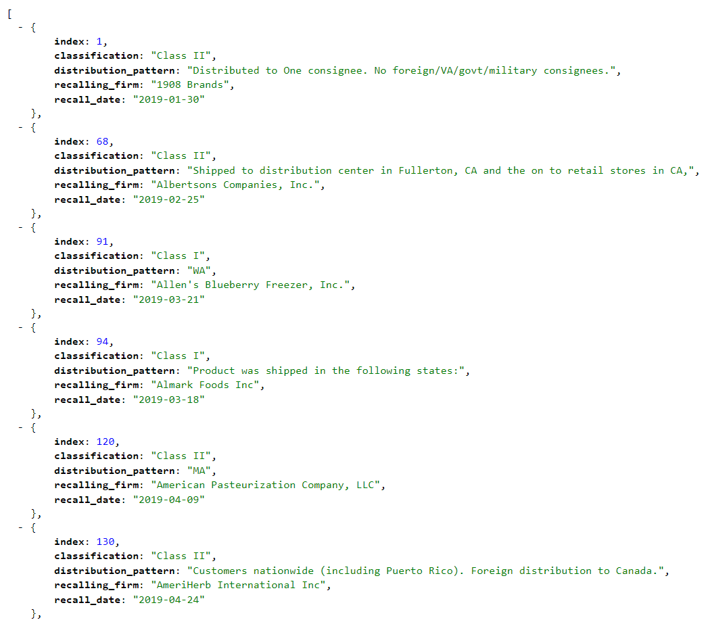

# FDA Food Recalls - Visualization Dashboards

**Description**  
The purpose of this project was to develop a full-stack application based on data on food recalls made available by the US Food & Drug Administration via the OpenFDA portal.  

**Data Source**  
  * [open.fda.gov](https://open.fda.gov/)  

**Process**  
  * Data was gathered from the OpenFDA portal via [direct download](https://open.fda.gov/downloads/).  Data for the Recent Recalls dashboard is pulled in real-time from the [fda.gov API for Food Recall Enforcement Reports](https://open.fda.gov/apis/food/enforcement/how-to-use-the-endpoint/).  
  * Downloaded data was cleaned using Python and pandas, and converted to a SQLite database with over 4,000 records of food recalls between 2012 and 2019.  
  * Flask was then used to create the necessary routes to serve the HTML pages and query the database.  
  * Visualizations were generated using Plotly, Leaflet, and JSCharting. Additionally, Popper.js and noUiSlider were used for HTML elements.  
  * User input is gathered via Javascript, data is retrieved from the database or fda.gov API, and visualizations are subsequently generated based on user-selected filters.  

---

**Landing Page**  

---

**Past Recalls Dashboard**  

This dashboard displays several visualizations based on SQL queries to a Flask endpoint, pulling data from the SQLite database.  User-selected filters are processed using Javascript and the visualizations are updated based on all filters currently selected.  These visualizations include (1) a pareto bar chart which displays the top ten recalling firms using Plotly and (2) a choropleth map indicating the relative number of recalls for each state using Leaflet.  An option has been included to normalize data by state population (using state population data from the 2010 Census).  Filters are available for Recall Classification (an indication of severity) as well as date range (slider created using noUiSlider).  Visualizations are updated immediately upon any changes to the normalization check box, classification check boxes, or date slider.  

---

**Recent Recalls Dashboard**  

This dashboard displays several visualizations based on a real-time query to the fda.gov API to collect the most recent 100 food recalls in the FDA's database (this database is updated weekly).  Similar to the Past Recalls Dashboard, user-selected filters are processed using Javascript and the visualizations are updated based on all filters currently selected.  These visualizations include (1) a pareto bar chart which displays the top ten recalling firms using Plotly and (2) a choropleth map indicating the relative number of recalls for each state using Leaflet.  An option has been included to normalize data by state population (using state population data from the 2010 Census).  Filters are available for Recall Classification (an indication of severity).  Visualizations are updated immediately upon any changes to the normalization check box or classification check boxes.  Additionally, clicking on a state will display a summary of all recalls affecting that state which meet the currently selected filters.  

---

**Recalls by State over Time**  

This page displays a time-series line chart from 2012-2019 using JSCharting based on SQL queries to a Flask endpoint, pulling data from the SQLite database.  National average is shown by default, and states can be added or removed from the chart by clicking the associated state name.  

---

**Data Format**  

The data returned from the endpoint(s) of the Flask app are a list of recall objects from the database that meet the criteria passed in the url string.  

